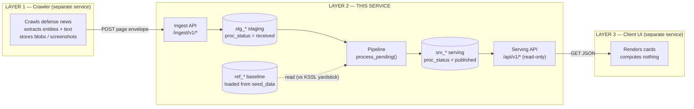
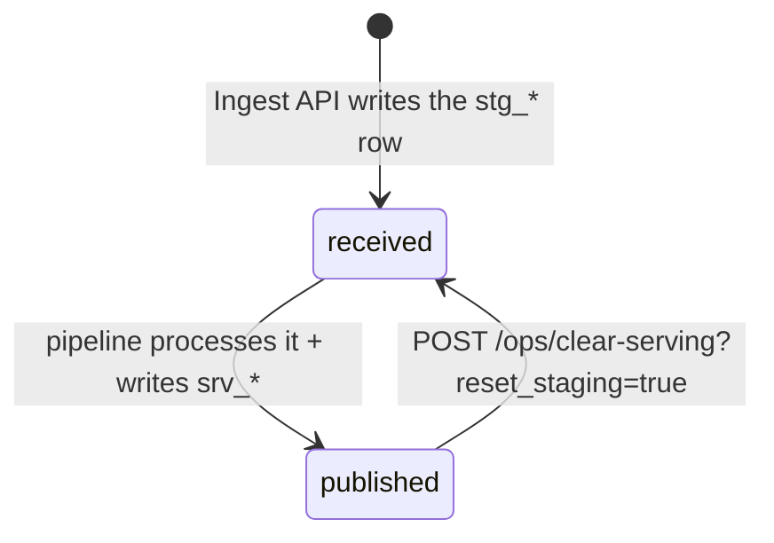
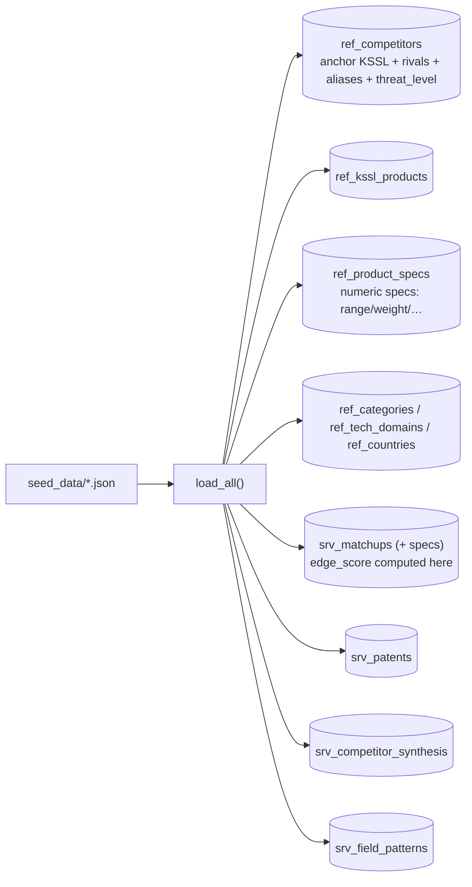
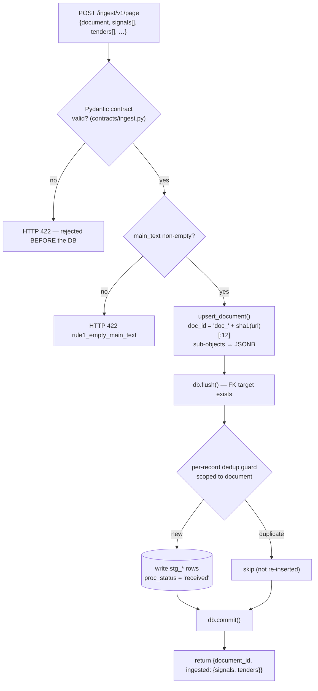
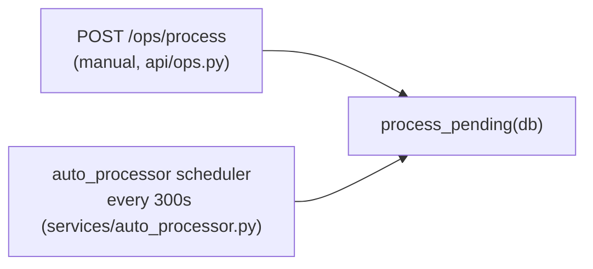
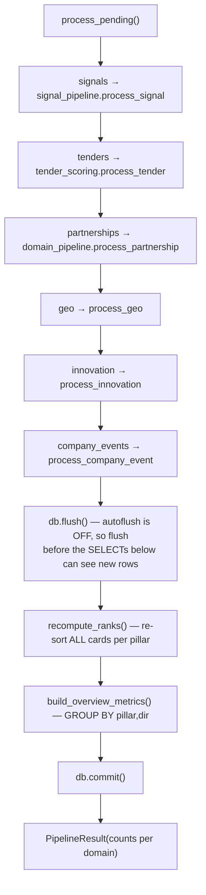
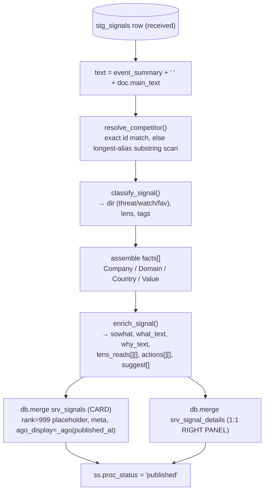
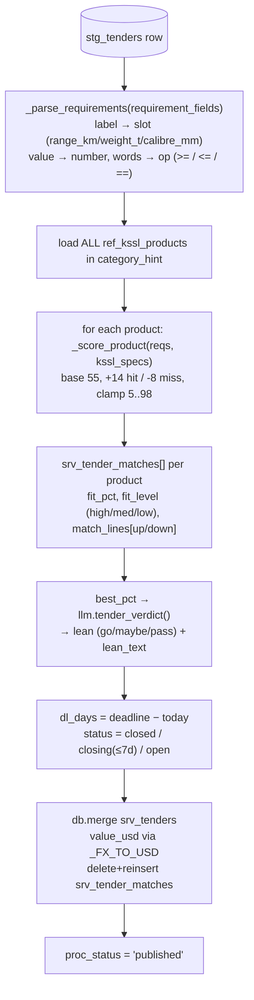
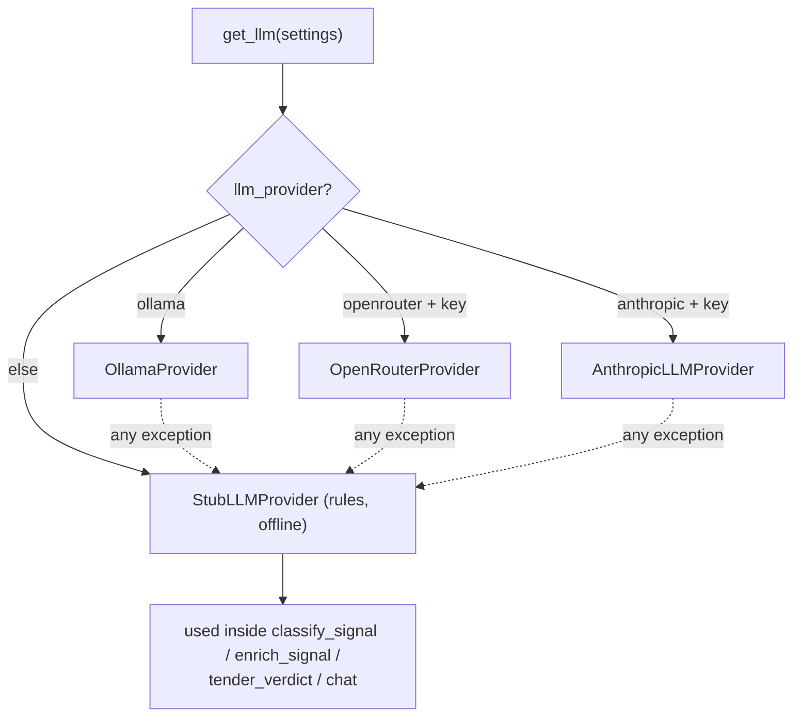
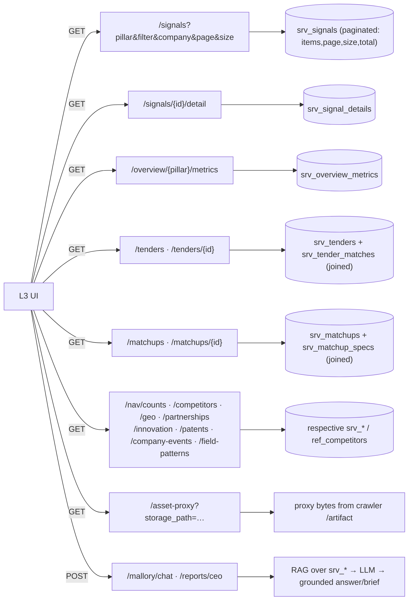

# Mallory Layer 2 — Data Flow (start to end)

How data moves through **Layer 2 (this service)**: from the moment the crawler POSTs a
record, through every processing step, to the JSON the Layer 3 UI renders. Everything here
is traced from the code in `src/mallory_engine/`, with `file:line` references so you can
jump straight to the implementation.

> **The one rule that shapes the whole layer:** *L3 renders, L2 computes.* Every value the
> UI shows — the threat colour, the sort order, the "so what" line, the tender fit %, the
> header counts — is a **literal column in a `srv_*` table**, produced here. The client does
> plain `GET`s and paints the result. No scoring, sorting, or date math in the browser.

---

## 0. The big picture — L1 → L2 → L3



**Two interfaces, one internal:**

| Interface | Direction | Entry file | Endpoints |
|---|---|---|---|
| **Ingest API** | L1 → L2 (write) | `api/ingest.py` | `POST /ingest/v1/page`, `/document`, `/{record_type}` |
| **Serving API** | L2 → L3 (read) | `api/serving.py` | `GET /api/v1/*` (signals, tenders, matchups, …) |
| **Ops** | internal | `api/ops.py` | `POST /ops/process`, `/clear-serving`, `GET /ops/status` |

---

## 1. The three table namespaces + the state machine

Data lives in three namespaces (all SQLAlchemy models under `models/`):

| Prefix | Meaning | Written by | Read by | Model file |
|---|---|---|---|---|
| `ref_*` | Static **"vs KSSL" baseline** — competitors, KSSL products, specs, categories | `seed/loader.py` (once) | pipeline | `models/reference.py` |
| `stg_*` | **Raw crawler input**, append-only, carries `proc_status` | Ingest API | pipeline | `models/staging.py` |
| `srv_*` | **Finished, denormalized cards** — the only thing L3 reads | pipeline + seed | Serving API | `models/serving.py` |

Every staging row walks a `proc_status` state field. **The code only ever writes two of
these states** (the finer `resolved/classified/enriched` in the model docstring are
aspirational — `process_signal` does all of it in one function):



This flag is the **idempotency mechanism**: the pipeline only ever picks up `received`
rows, so re-running is always safe (`pipeline/runner.py:33-65`).

---

## 2. PHASE 0 — Startup: load the baseline (`seed/loader.py:load_all`)

Before any crawler data, `load_all()` reads `seed_data/*.json` into the reference tables
the pipeline measures against, and pre-computes a few serving tables directly from seed.



- `edge_score = clamp(50 + 12*(kssl_leads − comp_leads), 5, 95)` and `_spec_leader()`
  decides comp/kssl/tie per spec from numeric values + polarity (`loader.py:129-194`).
- These seed-loaded `srv_*` tables are **always visible** (even when the visibility gate
  hides pipeline output) and exist before the crawler ever runs.

**State after Phase 0:** the "vs KSSL" yardstick exists in `ref_*`; static
positioning/patents/synthesis cards already sit in `srv_*`.

---

## 3. PHASE 1 — Entry: L1 → L2 ingest (`api/ingest.py:ingest_page`)



**What ingest does *not* do: any analysis.** It is a validating write-through:

1. **Contract firewall** — the body parses into `PageEnvelopeIn`. Enums (`stream`,
   `event_type`, `rel_type`, …) are `Literal[...]`; required fields enforced. Malformed →
   422 before it touches staging.
2. **Document upsert** (`ingest.py:43`) — deterministic `doc_id` from the URL so the same
   page always maps to the same row; `images/attachments/screenshot/tables/entities_detected`
   are `model_dump(mode="json")`'d into JSONB; then `db.flush()`.
3. **Per-record dedup guards** — scoped to the document:
   - signals → `(document_id, event_summary)`
   - tenders → `(document_id, source_ref or title)`
   - partnerships/geo/innovation/company_events → `(document_id, partner_name / product_name+country / title / headline)`
4. **Commit.** Rows land in `stg_*` with `proc_status='received'`.

**State after Phase 1:** raw rows in `stg_*`, **zero analysis**, invisible to L3.

---

## 4. PHASE 2 — Trigger: what starts processing

Two callers, one function (`pipeline/runner.py:process_pending`):



The auto-processor spawns an asyncio loop at app startup (`main.py` → `start_scheduler()`)
that runs the pipeline in a worker thread every 5 minutes (first run after 5 min).

---

## 5. PHASE 3 — Orchestrator (`pipeline/runner.py:process_pending`)

Runs each domain **sequentially**, over only `proc_status='received'` rows, then does a
**global** rank + metrics recompute, then commits once.



Key mechanics:
- **`flush()` is mandatory** — the session runs `autoflush=False` (`db.py:15`), so freshly
  `merge`'d serving rows must be flushed before `recompute_ranks`/`build_overview_metrics`
  can `SELECT` them.
- **Rank + metrics are global**, not per-batch — they reflect the entire published corpus.

---

## 6. PHASE 4 — The transforms: what each record becomes

### 6a. Signals — the main feed (`services/signal_pipeline.py:process_signal`)



Step by step (`signal_pipeline.py:36-86`):
1. **Gather text** — resolution scans the *full article* (`event_summary + main_text`), not just the summary.
2. **Resolve competitor** (`entity_resolution.py:32`) — exact `competitor_id` in `ref_competitors`, else a longest-alias-first substring scan; result written back to `ss.resolved_competitor_id`, plus the competitor's `name` + `threat_level`.
3. **Classify** (`llm.classify_signal`) — stub uses keyword rules: fav-words → `fav`; market + opening-words → `watch`; threat-words → `threat`; else the competitor's `threat_level`. Emits `dir`, `lens` (by stream), `tags`.
4. **Facts** — `[["Company",…],["Domain",…],["Country",…],["Value",…]]`.
5. **Enrich** (`llm.enrich_signal`) — from `dir` + facts builds the "so what", the what/why prose, `lens_reads`, `actions`, `suggest` — all KSSL-framed.
6. **`meta`** = `" · ".join(tech_domain, company, deal_value_raw)`.
7. **Publish** via `db.merge` (upsert on `id=ss.id`) into `srv_signals` + `srv_signal_details`; `rank` is a placeholder **999** (overwritten in 6b); `ago_display = _ago(published_at)` → `"today" / "5d ago" / "Jun 2026"`.
8. `proc_status = 'published'`.

### 6b. Ranking — global, per pillar (`signal_pipeline.py:recompute_ranks`)

Loads **all** `srv_signals`, groups by `pillar`, sorts each group by
`(_DIR_WEIGHT{threat:3, watch:2, fav:1}, published_at)` **descending**, and rewrites
`rank = 1,2,3…`. The UI then simply `ORDER BY rank`.

### 6c. Metrics — the header strip (`services/metrics.py:build_overview_metrics`)

One `GROUP BY (pillar, dir) COUNT`. For each pillar, emits `metrics[]` =
Threats / Watch / Favourable / Total, each `{label, value, color, filter}`, and `merge`s a
`srv_overview_metrics` row. All header math is now precomputed.

### 6d. Tenders — the richest transform (`services/tender_scoring.py:process_tender`)



### 6e. Partnerships / Geo / Innovation / Company-events (`services/domain_pipeline.py`)

Each is a single function: **resolve competitor → derive a "vs KSSL" field → publish**.

| Domain | Derived "vs KSSL" field | Notes |
|---|---|---|
| Partnership | `kssl_relevance = CORE if detected_lines else ADJACENT if partner_kind else context` + `meaning` (Threat/Opening/Dependency) | |
| Geo | `provenance = sourced if confidence in (high,medium) else estimate` | |
| Innovation | `gap_vs_kssl = behind if competitor_id else parity` + `impact`/`action` | |
| Company-event | `kssl_relevance = CORE if lines else context` + `kssl_impact` | published with explicit `id=se.id` |

> Two details from the code: (1) these four use **`db.add`** (plain INSERT), unlike
> signals/tenders which `merge` — safe only because of the `proc_status` guard. (2) The code
> **fully processes company-events** even though the older design doc says it doesn't.

**State after Phase 4:** every processed `stg_*` row is `published`; matching `srv_*` cards
carry all UI fields as literal columns.

---

## 7. PHASE 5 — The LLM seam (`services/llm.py`)

The pipeline never imports a vendor SDK. It depends only on the `LLMProvider` **Protocol**
(4 methods). `get_llm()` selects the implementation; every real provider **falls back to the
deterministic stub on any error**, so pipeline output shape is identical with or without an LLM.



The stub is deterministic rules — which is why the whole engine runs offline and the tests
are reproducible. *(Fragility: `process_signal` reads `enr['what_text']` by key; a real model
returning valid JSON with a missing key would KeyError that row.)*

---

## 8. PHASE 6 — Exit: L2 → L3 serving (`api/serving.py`, `services/assistant.py`)

Every endpoint is a **thin read**: WHERE/ORDER BY on already-computed columns → Pydantic DTO
(`contracts/serving.py`, `from_attributes=True`) → JSON. No compute.



Serving mechanics worth knowing:
- **Pagination only on `/signals`** (`Page{items,page,size,total}`); all other lists are flat arrays.
- **Sub-resources are joined server-side:** `_tender_with_matches` attaches `matches[]`; `_matchup_with_specs` attaches `specs[]`.
- **`provenance` = "sourced" | "estimate"** tells the UI whether to badge a row as inferred.
- **Visibility gate** (`serving_visible`, `serving.py:56`): when `SERVING_DATA_VISIBLE=false`, pipeline endpoints return empty/404 while **seed-loaded** tables (matchups, patents, synthesis, field-patterns, competitors) stay visible. Data isn't deleted — just hidden.
- **Asset proxy** streams bytes from the crawler's `/artifact` endpoint (`services/asset_client.py`) so L3 can show crawler-hosted images without touching L1 directly.

**State after Phase 6:** L3 has fully-rendered cards. It computed nothing.

---

## 9. PHASE 7 — Lifecycle / ops (`api/ops.py`)

| Endpoint | Effect |
|---|---|
| `POST /ops/process` | Run the pipeline now (same `process_pending`) |
| `GET /ops/status` | `proc_status` counts per staging table + serving row counts (monitor view) |
| `POST /ops/clear-serving?reset_staging=` | Delete only **pipeline-generated** `srv_*` (seed tables untouched); optionally flip `published` staging rows back to `received` so the pipeline reprocesses them |

---

## 10. Worked example — one signal, crawler → screen

```
CRAWLER POST /ingest/v1/page
  document.url = https://defensenews.com/...knds-caesar-nigeria
  document.main_text = "KNDS remporte une commande de CAESAR 6x6 pour le Nigeria..."
  record: { stream:"competitive", competitor_id:"KNDS",
            event_summary:"KNDS wins CAESAR artillery contract in Nigeria",
            detected_country:"Nigeria", tech_domain:"artillery" }
        │
        ▼   PHASE 1 — validate + write
stg_documents(id="doc_29fe…")  +  stg_signals(id=21, proc_status="received")
        │
        ▼   PHASE 3/4 — pipeline
S-05 resolve : "KNDS" ∈ ref_competitors → name="KNDS (Nexter / KMW)", threat_level="threat"
S-07 classify: "wins" is a threat-word → dir="threat", lens="BENCHMARK", tags=["threat"]
S-09 enrich  : sowhat="This strengthens KNDS on a line KSSL contests — expect direct
               pressure on KSSL's bids and pricing."  (+ what/why/lens_reads/actions/suggest)
S-10 rank    : among competitive threats by recency → rank=5, rank_group="Priority — Threats"
S-11 metrics : threats count +1, total +1
        │
        ▼   PHASE 4 — publish (proc_status → "published")
srv_signals(id=21): pillar="competitive", dir="threat", rank=5,
                    meta="artillery · KNDS (Nexter / KMW)", ago_display="5d ago", …
srv_signal_details(signal_id=21): facts, what_text, why_text, lens_reads, actions, suggest
        │
        ▼   PHASE 6 — serve
GET /api/v1/signals?pillar=competitive
  → { items:[ {id:21, dir:"threat", rank:5, title:"KNDS remporte…",
               meta:"artillery · KNDS", sowhat:"This strengthens KNDS…",
               lens:"BENCHMARK", tags:["threat"], ago_display:"5d ago"} … ],
      page:1, size:20, total:69 }
GET /api/v1/signals/21/detail  → the full right-panel object
        │
        ▼
L3 renders the card + detail panel. Zero computation client-side.
```

---

## 11. Endpoint reference (L2 → L3)

| Method | Path | Serves | Source table(s) |
|---|---|---|---|
| GET | `/api/v1/signals` | Intelligence feed (paginated, filtered) | `srv_signals` |
| GET | `/api/v1/signals/{id}/detail` | Signal detail panel | `srv_signal_details` |
| GET | `/api/v1/overview/{pillar}/metrics` | Header metric strip | `srv_overview_metrics` |
| GET | `/api/v1/tenders` · `/tenders/{id}` | Tender list / detail + matches | `srv_tenders` (+`srv_tender_matches`) |
| GET | `/api/v1/nav/counts` | Left-rail counts | all `srv_*` counts |
| GET | `/api/v1/competitors` · `/competitors/{id}/synthesis` | Competitor list / profile | `ref_competitors`, `srv_competitor_synthesis` |
| GET | `/api/v1/matchups` · `/matchups/{id}` | Positioning + specs | `srv_matchups` (+`srv_matchup_specs`) |
| GET | `/api/v1/partnerships` | Partnership list | `srv_partnerships` |
| GET | `/api/v1/geo` | Geo footprint | `srv_geo_entries` |
| GET | `/api/v1/innovation` | Tech watch | `srv_innovation` |
| GET | `/api/v1/patents` | Patents | `srv_patents` |
| GET | `/api/v1/company-events` | Company events | `srv_company_events` |
| GET | `/api/v1/field-patterns` | Cross-cutting observations | `srv_field_patterns` |
| GET | `/api/v1/asset-proxy` | Image/screenshot/PDF proxy | crawler `/artifact` |
| POST | `/api/v1/mallory/chat` | AI analyst (RAG over serving data) | `srv_*` |
| POST | `/api/v1/reports/ceo` | Executive brief | `srv_*` |
| GET | `/health` | Health check | — |

---

## 12. File → responsibility map

```
src/mallory_engine/
├─ config.py                 env settings (DB URL, LLM provider, visibility gate, CORS)
├─ db.py                     engine, SessionLocal (autoflush OFF), Base, get_db()
├─ main.py                   app factory, routers, CORS, startup → auto-processor, /health
├─ models/
│  ├─ reference.py           ref_*  (the vs-KSSL baseline)
│  ├─ staging.py             stg_*  (raw crawler input + proc_status)
│  └─ serving.py             srv_*  (denormalized UI cards)
├─ contracts/
│  ├─ ingest.py              L1→L2 contract (the 422 firewall)
│  └─ serving.py             L2→L3 DTOs
├─ api/
│  ├─ ingest.py              PHASE 1 — validate + write staging
│  ├─ serving.py             PHASE 6 — read-only endpoints + visibility gate + asset proxy
│  ├─ ops.py                 PHASE 2/7 — run pipeline, status, clear/reset
│  └─ assistant.py           /mallory/chat + /reports/ceo endpoints
├─ services/
│  ├─ entity_resolution.py   S-05 resolve competitor
│  ├─ llm.py                 provider Protocol + stub/anthropic/openrouter/ollama
│  ├─ signal_pipeline.py     S-07/09/10 classify → enrich → publish → rank
│  ├─ tender_scoring.py      S-12/13 parse requirements → score vs KSSL → verdict
│  ├─ domain_pipeline.py     partnerships / geo / innovation / company-events
│  ├─ metrics.py             S-11 overview metric strip
│  ├─ assistant.py           S-25/26 RAG chat + CEO report
│  ├─ auto_processor.py      background scheduler (every 300s)
│  └─ asset_client.py        proxy to crawler /artifact
├─ pipeline/runner.py        PHASE 3 — orchestrates all domains + rank + metrics
├─ seed/loader.py            PHASE 0 — seed_data/*.json → ref_* (+ seed srv_*)
└─ scripts/                  init_db · load_seed · run_pipeline · mock_feeder
```

---

## 13. Invariants & gotchas (from the code, not the doc)

- **`ref_*` never changes at runtime** — it's the fixed yardstick loaded once from seed.
- **Idempotency = the `proc_status` guard**, not upserts (partnerships/geo/innovation/
  company-events use plain `db.add`).
- **Rank + metrics recompute globally** every run, over the whole published corpus.
- **The state machine effectively has two states** (`received` → `published`); the finer
  states in the model docstring aren't written by the code.
- **Company-events are fully wired** (processed + served) — the code is ahead of the older
  design doc that says they aren't.
- **Visibility gate hides pipeline output only** — seed `srv_*` tables stay visible.
- **The LLM is optional** — any provider failure falls back to the deterministic stub, so
  the pipeline always produces complete, well-shaped output.
