# L2 Data Flow — a Competitive Signal, end to end

How data flows through the L2 functions to produce the final intelligence a card serves.

**Running example** — the crawler harvests a page:

> *"Larsen & Toubro secures ₹4,500 crore K9 Vajra artillery order from the Indian Army."*

We follow it through every function until it becomes a card L3 renders. The one rule visible at
every step: **deterministic code owns the numbers** (resolution, corroboration, confidence, fit,
ranking, graph); the **LLM only classifies, writes prose, and synthesizes over cited evidence.**

---

## Flow chart

```mermaid
flowchart TD
    START([Crawler harvests + gates a page]):::ext --> ING

    subgraph P1["PHASE 1 · INGEST — api/ingest.py"]
        ING["POST /ingest/v1/page<br/>ingest_page()"]:::plb --> VAL{"Pydantic valid?<br/>contracts/ingest.py"}:::plb
        VAL -->|no| ERR["HTTP 422 rejected"]:::err
        VAL -->|yes| UPS["upsert_document()"]:::plb
        UPS --> STGDOC[("StgDocument<br/>proc_status = received")]:::stg
    end

    STGDOC --> SCHED["_scheduler_loop every 60s<br/>main.py → process_pending(db)"]:::plb
    SCHED --> LLM

    subgraph P3["PHASE 3 · PIPELINE — pipeline/runner.py · process_pending"]
        LLM["get_llm(db=db) → farm text-model<br/>+ cache / ledger"]:::plb
        EXT["extract_pending() — extraction.py<br/>fast LLM, regex fallback"]:::hyb
        STGSIG[("StgSignal<br/>competitive · received")]:::stg
        CORR["corroboration_counts()<br/>corroboration.py → sig.id : 3"]:::hyb
        LLM --> EXT --> STGSIG --> CORR

        subgraph PS["process_signal() — signal_pipeline.py (per signal)"]
            R1["1. resolve_competitor() → LT"]:::det --> R2["2. classify_signal()<br/>stub dir=threat + fast LLM lens"]:::hyb --> R3["3. build facts"]:::det --> R4["4. enrich_signal()<br/>deep LLM + numbers_grounded"]:::llm --> R5["5. confidence.score() → 82 / high"]:::det
        end
        CORR --> R1

        R5 --> SRVSIG[("SrvSignal + SrvSignalDetail")]:::srv
        R5 --> EVID[("SrvEvidence — provenance")]:::srv
        SRVSIG --> RANK["recompute_ranks() → #1 threat"]:::det --> MET["build_overview_metrics()"]:::det --> GB["rebuild_graph()<br/>signal —about→ competitor:LT"]:::det --> GA["run_analytics()"]:::det --> COMMIT["db.commit()"]:::plb
    end

    COMMIT --> SYN

    subgraph P4["PHASE 4 · COMPETITOR SYNTHESIS — POST /ops/synthesize"]
        SYN["synthesize_competitor(LT)<br/>competitor_synthesis.py"]:::llm --> G["_gather() → top 60 evidence"]:::det --> FLOOR{"≥ 3 evidence?"}:::det
        FLOOR -->|no| KEEP["keep seed row (fail-safe)"]:::det
        FLOOR -->|yes| SYNLLM["llm.synthesize_competitor()<br/>deep LLM, cites required"]:::llm --> DROP["drop uncited vulnerabilities"]:::det --> SRVSYN[("SrvCompetitorSynthesis")]:::srv
    end

    SRVSIG --> SERVE
    SRVSYN --> SERVE

    subgraph P5["PHASE 5 · SERVING — api/serving.py (srv_* only)"]
        SERVE["L3 GET /api/v1/signals?pillar=competitive<br/>/detail · /synthesis · /explain"]:::plb
    end

    SERVE --> UI([L3 renders card · dossier · synthesis]):::ext

    classDef det fill:#e7f4f1,stroke:#1f8a7c,color:#0b3b34;
    classDef llm fill:#f0e9f8,stroke:#7a54b3,color:#2e1a4d;
    classDef hyb fill:#f7ece0,stroke:#bd6f2e,color:#4a2c10;
    classDef plb fill:#eceff2,stroke:#61707f,color:#25303a;
    classDef stg fill:#fff6e0,stroke:#c79a2e,color:#4a3a0e;
    classDef srv fill:#e3eefb,stroke:#3a6ea5,color:#12314f;
    classDef ext fill:#f2f2f4,stroke:#9aa4b0,color:#333,stroke-dasharray:4 3;
    classDef err fill:#fbe4e4,stroke:#c0392b,color:#5a1a13;
```



**Legend** — 🟩 DET deterministic · 🟪 LLM llm-first · 🟧 HYB hybrid · ⬜ PLB plumbing · 🟨 `stg_*` staging · 🟦 `srv_*` serving.

---

## Phase-by-phase (function detail)

### PHASE 1 — Ingest (L1 → L2) · `api/ingest.py`

- **`ingest_page(payload, db)`** ([:135](../src/mallory_engine/api/ingest.py#L135)) or **`ingest_bundle(record_type, body, db)`** ([:172](../src/mallory_engine/api/ingest.py#L172)) — the crawler's forward shape.
- Body validated into `PageEnvelopeIn` / `DocumentIn` / `CompetitiveSignalIn` (`contracts/ingest.py`) → malformed = **HTTP 422** before the DB. `ingest_bundle` also rejects empty `main_text`.
- **`upsert_document(db, d)`** ([:43](../src/mallory_engine/api/ingest.py#L43)) — `_doc_id(url) = "doc_" + sha1(url)[:12]`, writes/updates **`StgDocument`**.
- In normal mode the crawler sends a **bare document** — L2 derives records in 3a. `db.commit()`.

**State:** `StgDocument` in staging, `proc_status = received`. Ingestion and compute are decoupled.

### PHASE 2 — Trigger · `main.py`

- **`_scheduler_loop(interval_s)`** ([:19](../src/mallory_engine/main.py#L19)) wakes every 60s → `asyncio.to_thread(process_pending, db)`. (Also `POST /ops/process`.)

### PHASE 3 — Pipeline · `pipeline/runner.py → process_pending(db)` ([:38](../src/mallory_engine/pipeline/runner.py#L38))

`llm = get_llm(db=db)` → db-bound provider (cache + `llm_runs` ledger active), farm **text-model**. Ordered stages:

**3a · Extraction — `extraction.extract_pending(db, llm)`**
1. Loads `StgDocument`s where `extracted_at IS NULL` with no child records (idempotent).
2. Fan-out: `worker_llm = llm.with_db(None)` (db-less in threads — the threadpool-hang fix) → `ThreadPoolExecutor(4)` runs `extract_records()`.
   - *tasks.py*: `_run_structured(task="extract_records", model=fast)` → `cache.lookup` → `transport.complete(EXTRACT_SCHEMA)` → validate `ExtractOut` → `_valid_competitor_ids` (drops hallucinated ids) → `cache.record`. `{}` → **regex fallback**.
3. Serially: **`_apply_llm_records()`** ([:178](../src/mallory_engine/services/extraction.py#L178)) → **`StgSignal`** `stream="competitive", competitor_id="LT", event_summary="…K9 Vajra order", deal_value_raw="₹4,500 cr", proc_status="received"`.

**3b · Corroboration — `corroboration.corroboration_counts(db)`**
- `_claim_key(sig)` = `"LT|IN|threat|45"`; `_embed_merge` merges near-duplicates via **bge-m3**. Returns `{sig.id: 3}` (three outlets).

**3c · Signal processing — `signal_pipeline.process_signal(db, llm, ss, corroboration=3)`** ([:38](../src/mallory_engine/services/signal_pipeline.py#L38))

| # | Call | Kind | Result |
|---|------|------|--------|
| 1 | `resolve_competitor()` | DET | `"LT"` → *Larsen & Toubro* |
| 2 | `llm.classify_signal()` | HYB | `dir/tags` from **stub rules** (`order` → threat), `lens` from **fast LLM** |
| 3 | build `facts` | DET | `[[Company,L&T],[Country,IN],[Value,₹4,500 cr]]` |
| 4 | `llm.enrich_signal()` | LLM | deep model → sowhat/why/actions; `numbers_grounded` checks the figure |
| 5 | `conf.score(independent_sources=3, provenance="sourced", pillar="competitive")` | DET | `(82, "high", parts)` |
| 6 | `db.merge(SrvSignal(...))` | — | **the card** (confidence 82, band high, corroboration 3) |
| 7 | `db.merge(SrvSignalDetail(...))` | — | **the dossier** |
| 8 | `write_evidence(target_kind="signal")` | DET | provenance → `/explain` |
| 9 | `ss.proc_status = "published"` | — | staging row retired |

**3d–3g** · tenders/partnerships/geo/innovation (no-op for a pure signal) → `recompute_ranks()` (threat → top rank) → `build_overview_metrics()` → `rebuild_graph()` (signal —`about`→ `competitor:LT`) → `run_analytics()` → **`db.commit()`**.

### PHASE 4 — Competitor synthesis · `POST /ops/synthesize` (NOT in `process_pending`)

`competitor_synthesis.synthesize_all` → **`synthesize_competitor(db, llm, "LT")`** ([:101](../src/mallory_engine/services/competitor_synthesis.py#L101)):
1. `_gather()` → all `SrvSignal` for L&T (incl. the new one) + partnerships + geo → top-60 `EvidenceItem`s.
2. **Evidence floor** < 3 → keep seed, skip.
3. `llm.synthesize_competitor()` → `SynthesisOut{thesis, vulnerabilities[cites], predictions, gaps, cites}`.
4. **Drop uncited vulnerabilities**; none survive → keep seed.
5. `_synthesis_confidence()` = mean of cited signals → `db.merge(SrvCompetitorSynthesis(...))` + per-field `write_evidence(method="llm")`.

### PHASE 5 — Serving (L2 → L3) · `api/serving.py`

| L3 view | Endpoint | Reads |
|---|---|---|
| Competitive Overview | `GET /api/v1/signals?pillar=competitive` | `SrvSignal` → `SignalCard[]` |
| Dossier | `GET /api/v1/signals/{id}/detail` | `SrvSignalDetail` |
| Metric strip | `GET /api/v1/overview/competitive/metrics` | `SrvOverviewMetrics` |
| Competitor read | `GET /api/v1/competitors/LT/synthesis` | `SrvCompetitorSynthesis` |
| "Why this?" | `GET /api/v1/explain/signal/{id}` | `SrvEvidence` → source doc |

---

## One line each

```
crawler POST
  → ingest_page / ingest_bundle       [api/ingest.py]      → StgDocument (received)
  → _scheduler_loop → process_pending  [main.py / runner.py]
      → extract_pending                [extraction.py]      → StgSignal (competitive, received)
      → corroboration_counts           [corroboration.py]   → {sig.id: 3}
      → process_signal                 [signal_pipeline.py]
          → resolve_competitor         [entity_resolution]  → LT / Larsen & Toubro
          → classify_signal            [tasks + stub]       → dir=threat, lens=BENCHMARK
          → enrich_signal              [tasks → deep model] → prose (numbers_grounded)
          → confidence.score           [confidence.py]      → 82 / high / parts
          → merge SrvSignal + Detail                        → CARD + DOSSIER
          → write_evidence             [evidence.py]        → provenance
      → recompute_ranks / metrics / rebuild_graph / analytics
  → /ops/synthesize → synthesize_competitor [competitor_synthesis.py] → SrvCompetitorSynthesis
  → L3 GET /api/v1/signals · /synthesis     [api/serving.py]           → rendered
```

*No number on the final card was produced by a model — resolution, corroboration, confidence,
ranking, and graph structure are all deterministic; the LLM owns the lens label, the prose, and
the cited synthesis only.*
