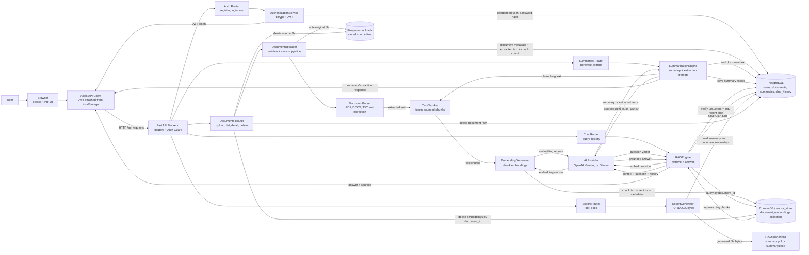

# DocuMind AI Block Data Flow Diagram

This diagram shows how data moves through DocuMind AI from the browser to the backend, storage systems, vector database, and AI providers.

## Block Data Flow



## Main Data Flows

### 1. Authentication

```text
User credentials
  -> React auth form
  -> POST /api/auth/register or /api/auth/login
  -> AuthenticationService
  -> PostgreSQL users table
  -> JWT returned to frontend
  -> JWT stored in localStorage
  -> JWT sent on protected API requests
```

### 2. Document Upload and Indexing

```text
PDF/DOCX/TXT file
  -> React DocumentUploader
  -> POST /api/documents/upload
  -> DocumentUploader validates extension, size, and integrity
  -> original file saved under uploads
  -> DocumentParser extracts text
  -> TextChunker creates chunks
  -> EmbeddingGenerator calls configured embedding provider
  -> ChromaDB stores vectors, chunk text, and metadata
  -> PostgreSQL stores document metadata and extracted text
```

### 3. Summary and Structured Extraction

```text
Selected document + summary/info type
  -> POST /api/summaries/generate or /api/summaries/extract
  -> backend verifies JWT and document ownership
  -> SummarizationEngine loads text from PostgreSQL
  -> TextChunker chunks long documents
  -> AI provider generates summary or extracted items
  -> summaries are persisted in PostgreSQL
  -> frontend displays result
```

### 4. Document Chat / RAG

```text
User question
  -> POST /api/chat/query
  -> backend verifies JWT and document ownership
  -> RAGEngine embeds question
  -> ChromaDB retrieves top chunks for the selected document_id
  -> RAGEngine loads recent chat history from PostgreSQL
  -> AI provider answers using retrieved context and history
  -> chat_history row is saved in PostgreSQL
  -> frontend displays answer and source chunk ids
```

### 5. Export

```text
Selected summary
  -> POST /api/export/pdf or /api/export/docx
  -> backend verifies summary ownership through document ownership
  -> ExportGenerator creates file bytes
  -> browser downloads summary.pdf or summary.docx
```

## Key Data Stores

```text
PostgreSQL
  users
  documents
  summaries
  chat_history

Filesystem uploads
  original uploaded PDF/DOCX/TXT files

ChromaDB / vector_store
  document_embeddings collection
  chunk vectors
  chunk text
  document_id, chunk_id, chunk_position, user_id metadata
```

## Trust and Control Boundaries

```text
Browser
  holds JWT in localStorage
  sends all protected requests through Axios

FastAPI backend
  validates JWT
  enforces document ownership
  owns all database, file, vector store, and AI provider access

External AI provider
  receives document text chunks, prompts, questions, and retrieved context
  returns embeddings, summaries, extracted items, or chat answers
```

